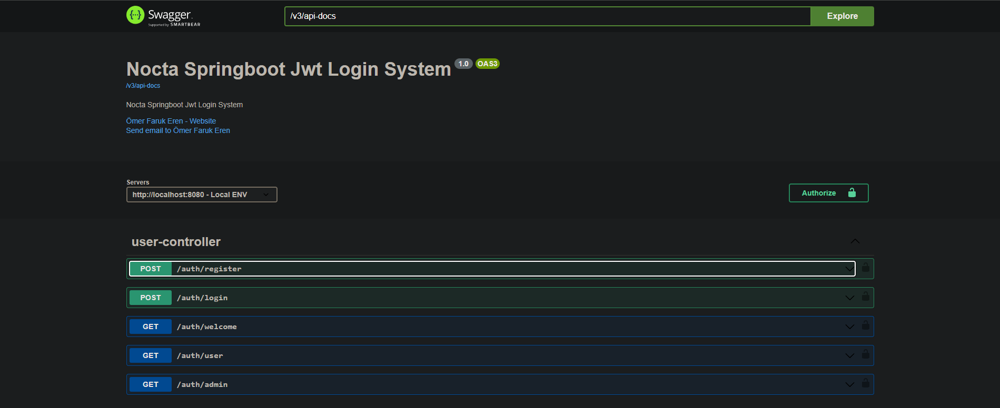
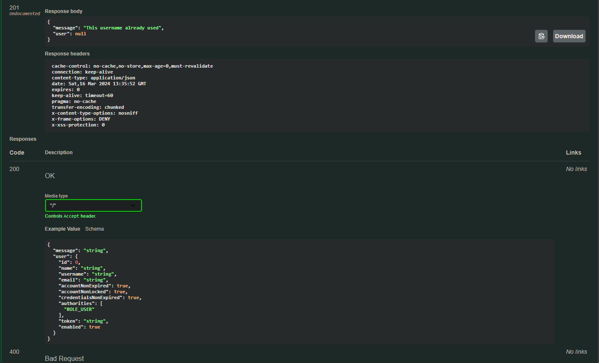
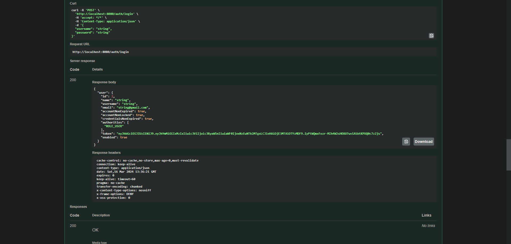
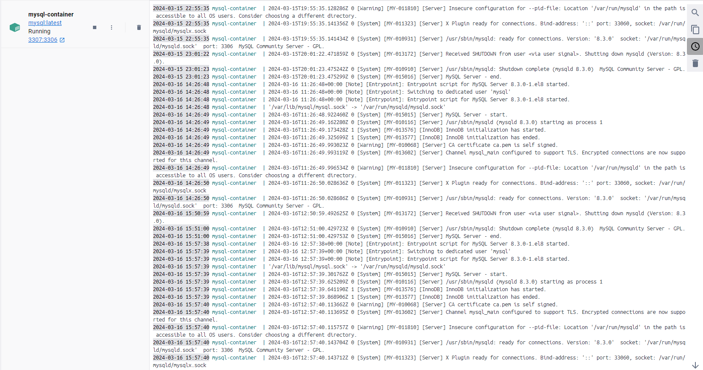
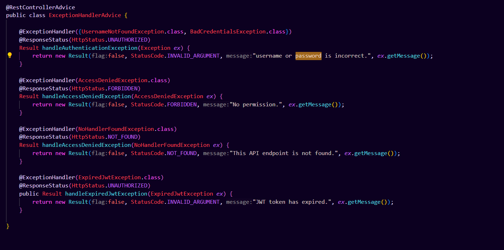
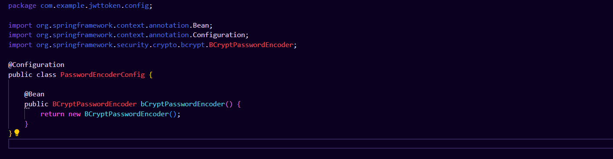

# JWT token kullanarak Kullanıcı Doğrulama, Yetkilendirme, Register, Login Restful Api

## Task hakkında
-16.03.2024

-Nocta Task

-Ömer Faruk Eren 
## Task isterlerine açıklama

Taskta istenen parola şifreleme(bCryptPasswordEncoder) ve hata mesajları(mail veya şifre hatası, kullanıcı zaten kayıtlı vs) yönetimi sağlanmıştır.

### Kullanılan Teknolojiler

- Spring Boot
- Spring Security
- JWT
- Docker Compose
- MySQL Database
- Swagger

### Kurulum

1. Repository'yi klonlayın:
   ```bash
   git clone https://github.com/hustledeveloper/nocta-jwt-token
   ```
2. Proje dizinine gidin:
   ```bash
   cd nocta-jwt-token
   ```
3. Docker Compose kullanarak MySQL veri tabanını oluşturun.
   ```bash
   docker-compose up -d
   ```
4. Spring Boot uygulamasını başlatın:
   ```bash
   ./mvnw spring-boot:run
   ```
5. Swagger arayüzünden test edin

   ```bash
   http://localhost:8080/swagger-ui/index.html

   ```

## Endpointler
<figure><figcaption></figcaption></figure>
<figure><figcaption></figcaption></figure>
<figure><figcaption></figcaption></figure>
<figure><figcaption></figcaption></figure>
<figure><figcaption></figcaption></figure>
<figure><figcaption></figcaption></figure>


### Auth/Register

**Endpoint:** `/auth/register` (POST)

**Açıklama:** Kullanıcı kaydı oluşturur

**Parametreler:**

- `username` (zorunlu)
- `password` (zorunlu)
- `name` (zorunlu)
- `authorities` (zorunlu)

### Auth/Login

**Endpoint:** `/auth/login` (POST)

**Açıklama:** Kullanıcı girişi yapar.

**Parametreler:**

- `username` (zorunlu)
- `password` (zorunlu)

### Auth/Welcome

**Endpoint:** `/auth/welcome` (GET)

**Açıklama:** Herkese açık bir hoşgeldiniz sayfasıdır.

### Auth/User

**Endpoint:** `/auth/user` (GET)

**Açıklama:** JWT token ile sadece yetkilendirilmiş kullanıcılar tarafından erişilebilir.

### Auth/Admin

**Endpoint:** `/auth/admin` (GET)

**Açıklama:** JWT token ile sadece admin rolüne sahip kullanıcılar tarafından erişilebilir.

### Auth/Logout

**Endpoint:** `/auth/logout` (GET)

**Açıklama:** JWT token ile kullanıcıyı sistemden çıkarır.

### Swagger UI

**Endpoint:** `/swagger-ui/index.html` (GET)

**Açıklama:** Swagger UI gösterir.
